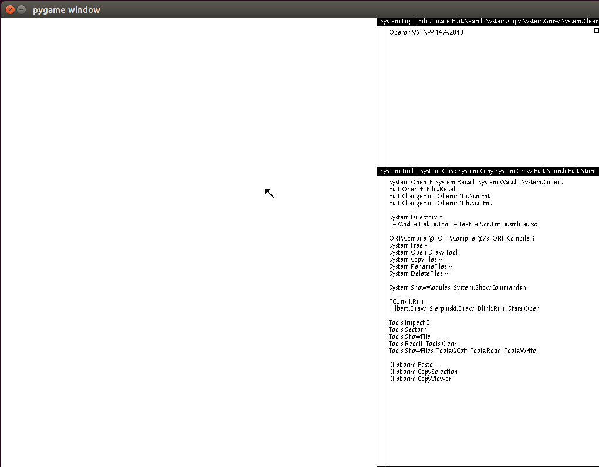

.. PythonOberon documentation master file, created by
   sphinx-quickstart on Sun May 12 15:49:46 2019.
   You can adapt this file completely to your liking, but it should at least
   contain the root `toctree` directive.

Python Oberon v0.1.0
========================================

An emulator written in Python for the Project Oberon RISC processor.  If
`PyGame <https://www.pygame.org/>`_ is available it will open a screen of the standard dimensions of
1024 x 768 pixels.  There's also a very crude "assembler".

* `Documentation <https://pythonoberon.readthedocs.io/en/latest/>`_
* `Source code <https://git.sr.ht/~sforman/PythonOberon>`_  (`mirror <https://github.com/PhoenixBureau/PythonOberon>`_)
* `Bugs & issues <https://todo.sr.ht/~sforman/python-oberon>`_
* `On PyPI <https://pypi.org/project/PythonOberon/>`_

Installing
----------------------------------

The usual way from PyPI::

    pip install PythonOberon

Starting the Emulator
----------------------------------

Once you have downloaded the code you can start the emulator from the
base directory with::

    python -i -m oberon

It will use the ``disk.img`` file and run for eight million cycles by
default.  At around 3400000 cycles the screen background begins to fill
in, and at around 6500000 cycles the window content begins to be drawn.

(The ``-i`` option tells the Python interpreter to drop into the 
interactive REPL after cycling the emulator.  Without it the script will
just exit and the screen will disappear.)

Screenshot
----------------------------------

After eight million cycles:

Module Documentation
----------------------------------

.. toctree::
   :maxdepth: 2

   assembler
   bootloader
   display
   risc
   util

Information on Oberon
----------------------------------

* `Oberon 2013 <http://www.inf.ethz.ch/personal/wirth/ProjectOberon/>`_
* `projectoberon.com <http://projectoberon.com/>`_
* `Project Oberon emulator in C <https://github.com/pdewacht/oberon-risc-emu>`_
* `Project Oberon emulators in JavaScript and Java <http://schierlm.github.io/OberonEmulator/>`_
* `A resource page for Oberon-07 <http://oberon07.com/>`_

Indices and tables
----------------------------------

* :ref:`genindex`
* :ref:`modindex`
* :ref:`search`
